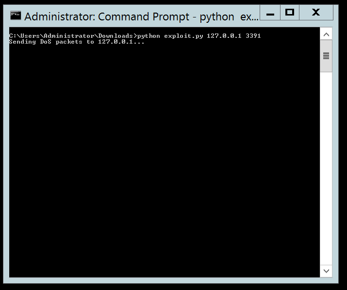

# CVE-2020-0609

The exploit use improper data reassembly in case of UDP Remote Desktop Gateway. It is possible to write in the heap which can result in remote code execution or denial-of-service.

## Exploit Details

The expected UDP packet has a maximum data of 1000 bytes. The packet is made with the frame:

Packet ID | Packet Length | Fragment ID | Number of fragments | Fragment Length

The reassembling code sets an offset equal to 1000 times fragment ID from 0 point. By crafting the Fragment ID correctly, it is possible to write somewhere else on the heap.

## Setup

Setup consisted of Windows 2012 R2 server with remote desktop gateway enabled. UDP connection was allowed on port 3391. It should be noted that UDP is on by default.

## Running PoC

`python exploit.py <host> <port>`

The given PoC does DoS attack.

We run the exploit locally for testing purpose.

